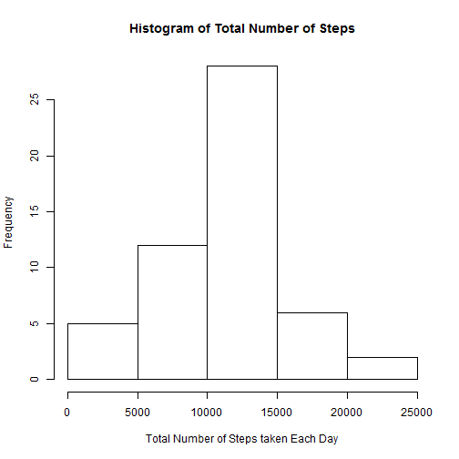
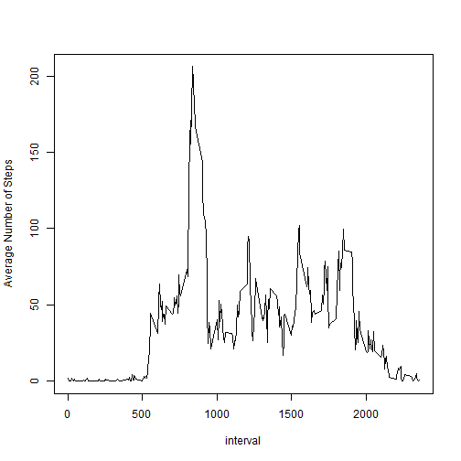
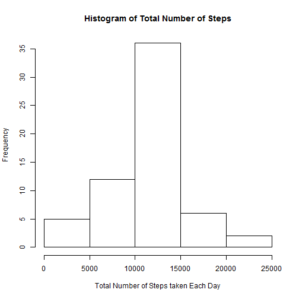
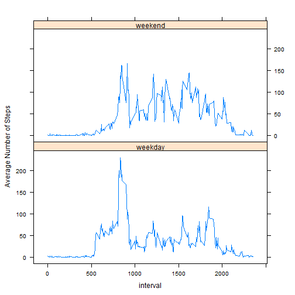

# Reproducible Research: Peer Assessment 1


## Loading and preprocessing the data

```r
suppressWarnings(library(data.table))
data <- data.table(read.csv('activity/activity.csv'))
data <- data[,date:=as.Date(date)]
data <- data[,interval:=as.ts(interval)]
```


## What is mean total number of steps taken per day?

```r
data[is.na(steps),list(TotalMissingIntervals=.N),by='date']
```

```
##          date TotalMissingIntervals
## 1: 2012-10-01                   288
## 2: 2012-10-08                   288
## 3: 2012-11-01                   288
## 4: 2012-11-04                   288
## 5: 2012-11-09                   288
## 6: 2012-11-10                   288
## 7: 2012-11-14                   288
## 8: 2012-11-30                   288
```
As above stats suggests, any date which has NA steps for some intervals should be removed before computing average number of steps per day, as it might result in unreliable results due to lack of complete data for those dates

```r
datesWithNASteps <- unique(data[is.na(steps)]$date)
data2 <- data[!(date %in% datesWithNASteps),list(TotalNoSteps=sum(steps)),by='date']
with(data2,hist(TotalNoSteps,xlab='Total Number of Steps taken Each Day',main='Histogram of Total Number of Steps'))
```

 

```r
mean(data2$TotalNoSteps)
```

```
## [1] 10766
```

```r
median(data2$TotalNoSteps)
```

```
## [1] 10765
```


## What is the average daily activity pattern?

```r
data3 <- data[!is.na(steps)]
data3 <- data3[,list(avgNoOfSteps=mean(steps)),by='interval']
with(data3,plot(interval,avgNoOfSteps,type='l',ylab='Average Number of Steps'))
```

 

```r
maxAvgSteps <- data3[order(avgNoOfSteps,decreasing=T)][1]
## 5-minute interval that, on average, contains the maximum number of steps is
maxAvgSteps$interval
```

```
## [1] 835
```


## Imputing missing values

```r
naData <- data[is.na(steps)]
## Data is missing for following number of entries
nrow(naData)
```

```
## [1] 2304
```
Imputation Strategy: Missing values for each interval can be imputed by average number of steps taken in that interval across all days(as computed above in 'data3')

```r
naData <- naData[,steps:=NULL]
naData <- merge(naData,data3,by='interval')
setnames(naData,'avgNoOfSteps','steps')
imputedData <- rbind(data[!is.na(steps)],naData[,colnames(data),with=F])
data4 <- imputedData[,list(TotalNoSteps=sum(steps)),by='date']
with(data4,hist(TotalNoSteps,xlab='Total Number of Steps taken Each Day',main='Histogram of Total Number of Steps'))
```

 

```r
mean(data4$TotalNoSteps)
```

```
## [1] 10766
```

```r
median(data4$TotalNoSteps)
```

```
## [1] 10766
```
Median differs from the estimates from the first part of the assignment but not mean.


## Are there differences in activity patterns between weekdays and weekends?

```r
imputedData <- imputedData[,daytype:=ifelse(weekdays(date,abbreviate=T) %in% c('Sun','Sat'),'weekend','weekday')]
imputedData <- imputedData[,list(AvgNoOfSteps=mean(steps)),by=c('interval','daytype')]
suppressWarnings(library(lattice))
with(imputedData,xyplot(AvgNoOfSteps~interval|daytype,type='l',layout=c(1,2),ylab='Average Number of Steps'))
```

 
